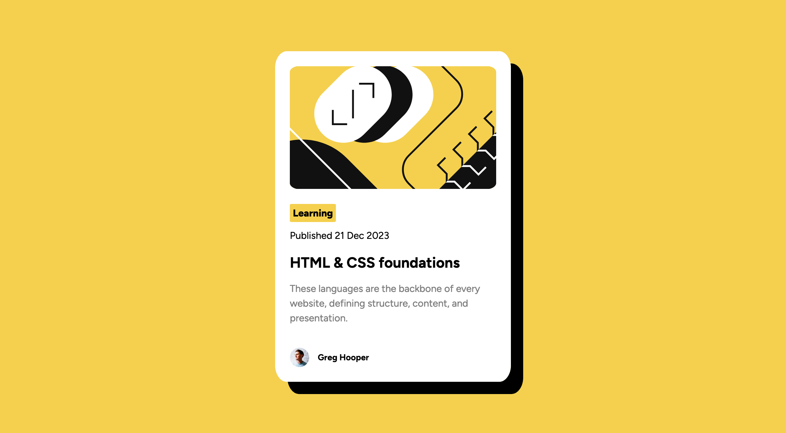
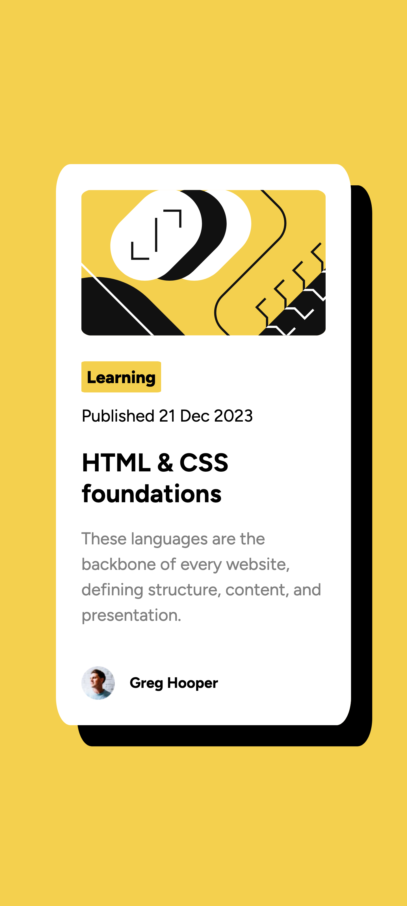

# Frontend Mentor - Blog preview card solution

This is a solution to the [Blog preview card challenge on Frontend Mentor](https://www.frontendmentor.io/challenges/blog-preview-card-ckPaj01IcS). Frontend Mentor challenges help you improve your coding skills by building realistic projects.

## Table of contents

- [Overview](#overview)
  - [The challenge](#the-challenge)
  - [Screenshot](#screenshot)
  - [Links](#links)
- [My process](#my-process)
  - [Built with](#built-with)
  - [What I learned](#what-i-learned)
  - [Continued development](#continued-development)
- [Author](#author)

## Overview

### The challenge

Users should be able to:

- See hover and focus states for all interactive elements on the page

### Screenshot

### Links

- Live Site URL: - [Blog-Preview-Card](http://viveknagesh.me/frontend.github.io/blog-preview-card/index.html)

## My process

1.  I started with HTML and used some custom tags and semantic markup.
2.  For styling, I used CSS Grid for the card. How do I say Grid was a natural fit for this card layout to me.

- Used the <main> element as the grid container and positioned the .blog-card class as the centered item within that Grid.
- I also discovered later that setting the grid container's height to 100vh (viewport height) makes it horizontally centered.
- I used Flexbox within the .blog-card class to manage the arrangement of its internal elements.

3. I had to figure out different margins, padding and font-size

### Built with

- Semantic HTML5 markup
- CSS custom properties
- Flexbox
- CSS Grid

### What I learned

- @fontface, font-weight,
- CSS Variable
- Flexbox and CSS Grid
- box-shadow

### Continued development

- I try experimenting this card style in further challenge.

## Author

- Website - [Vivek Nagesh](https://viveknagesh.me)
- Frontend Mentor - [@viveknagesh21](https://www.frontendmentor.io/profile/viveknagesh21)
- Twitter - [@viveknagesh21](https://www.twitter.com/viveknagesh21)
