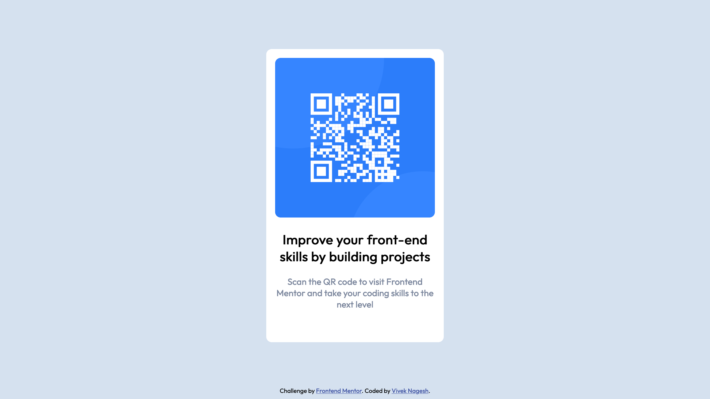

# Frontend Mentor - QR code component solution

This is a solution to the [QR code component challenge on Frontend Mentor](https://www.frontendmentor.io/challenges/qr-code-component-iux_sIO_H). Frontend Mentor challenges help you improve your coding skills by building realistic projects.

## Table of contents

- [Overview](#overview)
  - [Screenshot](#screenshot)
  - [Links](#links)
- [My process](#my-process)
  - [Built with](#built-with)
  - [What I learned](#what-i-learned)
- [Author](#author)
- [Acknowledgments](#acknowledgments)

## Overview

QR Card

### Screenshot

## My process

- Define the HTML structure for page. a div container, One qr-card div, a image, p, h2 element. Total 5 element.
- I used flexbox for centering the container with
  - margin:auto for left, right
  - align-items for center the qr-card div inside it.
  - Height as 100% of viewport

### Built with

- Flexbox

### What I learned

I learn about to center single component using flexbox.

## Author

- Website - [Vivek Nagesh](https://www.viveknagesh.me)
- Frontend Mentor - [@yourusername](https://www.frontendmentor.io/profile/viveknagesh21)
- Twitter - [@yourusername](https://www.twitter.com/viveknagesh21)
